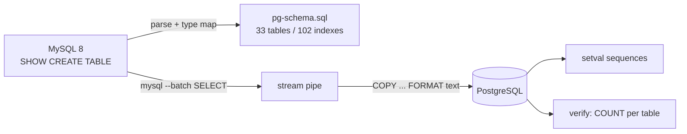

[mpazari.com](https://www.mpazari.com) is a Turkish motorcycle classifieds site I've been rewriting from a 2006-era ASP.NET WebForms application to Spring Boot 4 / Java 25, compiled to a GraalVM native image. Phase one deliberately kept the legacy MySQL schema untouched — the new app talked to the same `motosiklet` database the old site had used for two decades. Once the rewrite was stable and green in CI, the second half of the plan kicked in: move the database itself from MySQL 8 to PostgreSQL.

This post is the record of how that happened: why pgloader didn't work, the custom migration script that replaced it, the ~200 SQL statements I had to port by hand, and a cutover with about **3 minutes of actual downtime**.

## The starting point

- **MySQL 8.0.42**, system service on the prod box, `motosiklet` DB, 131 MB, 31 tables
- ~20.7k active listings, ~58k users, ~26k comments — plus legacy ASP.NET membership tables (`aspnet_*`, including the old `MySQLProfileProvider` blob format) still in active use
- **App**: Spring Boot 4 with plain `JdbcTemplate` / `NamedParameterJdbcTemplate` — no Hibernate, deliberately, because the deploy target is a GraalVM native binary (~90 MiB, boots in 0.061s)
- One dedicated server, Apache httpd + Cloudflare in front, no Docker (owner decision)

Because the app uses hand-written SQL against the legacy schema instead of an ORM, the migration surface was fully enumerable: ~200 statements in 20 Java files plus 15 Thymeleaf templates. That's the quiet superpower of `JdbcTemplate` in a migration like this — every dialect-ism is visible in source and greppable. An ORM would have hidden half of them behind generated SQL.

## Why not pgloader

pgloader is the standard answer to "MySQL → PostgreSQL", so it was the first thing I tried: the `dimitri/pgloader` Docker image and the Debian bookworm apt package. Both ship `3.6.7~devel`, and both failed with the same error:

```
QMYND:MYSQL-UNSUPPORTED-AUTHENTICATION
```

Its bundled MySQL client simply cannot authenticate against MySQL 8 — even for a `mysql_native_password` user (verified server-side that the same credentials work fine via the `mysql` CLI). I wasn't going to patch pgloader, so I wrote my own script instead. In hindsight that was the right call anyway: it gave me full control over the type mapping and the data landmines, which turned out to be the interesting part.

## The migration script

`migrate_mysql_to_pg.py` (~250 lines of Python, stdlib only) with four modes: `schema`, `data`, `verify`, `scan`. It auto-discovers tables via `SHOW TABLES`, so the same script ran unchanged against the local rehearsal (33 tables) and prod (31 tables).

### Schema conversion

`SHOW CREATE TABLE` output parsed into PostgreSQL DDL. The type mapping table was where every decision lived:

| MySQL | PostgreSQL | Why |
| --- | --- | --- |
| identifiers | all-lowercase | PG folds unquoted identifiers; the app SQL is unquoted, so it keeps working |
| `tinyint(1)` / `bit(1)` | `smallint` — **not** `boolean` | the app does `COALESCE(IsApproved,1)=1` integer comparisons; `rs.getBoolean` works fine on smallint |
| `int unsigned` | `bigint` | |
| `bigint unsigned` | `numeric(20,0)` | |
| `enum(...)` | `varchar(64)` | |
| `char(n)` | `varchar(n)` | |
| zero-date defaults | `NULL` | |
| `AUTO_INCREMENT` | `GENERATED BY DEFAULT AS IDENTITY` | + `setval` after load |

FULLTEXT indexes were skipped on purpose — search had already moved to Meilisearch. Result: 33 tables + 102 indexes generated mechanically, no hand-editing.

### Data: stream, don't stage

The trick that makes the whole thing fast and simple: **`mysql --batch` escaping (`\t`, `\n`, `\\`) is exactly PostgreSQL `COPY ... FORMAT text` escaping.** So the script pipes `mysql`'s stdout directly into `psql`'s `COPY` — no intermediate files, no CSV quoting hell:

```python
src = subprocess.Popen(MYSQL + ["-e", f"SELECT {sel} FROM `{table}`"],
                       stdout=subprocess.PIPE)
sql = (f"COPY {table} ({copylist}) FROM STDIN "
       f"WITH (FORMAT text, NULL {PG_NULL})")
r = subprocess.run(PSQL + ["-c", sql], stdin=src.stdout, ...)
```

Three data landmines, each with a specific fix:

1. **NULL vs the literal string "NULL".** Batch mode writes an unescaped `NULL` for null values, which could collide with a real text value `"NULL"` in the data. Fix: a sentinel — every nullable column is selected as `IFNULL(col, CONCAT(0x01,'NULL'))` and `COPY` declares `NULL E'\001NULL'`. A `scan` mode pre-checks that no text column contains the `0x01` byte or a literal `'NULL'` value.
2. **Zero dates.** Under `NO_ZERO_DATE`, even *comparing* a datetime column against `'0000-00-00'` throws — the comparison itself errors, not just the insert. Fix: `CAST(col AS CHAR)` first (string comparison doesn't trigger it), then `NULLIF(..., '0000-00-00 00:00:00')`.
3. **Raw CR bytes.** `mysql --batch` passes `\r` through raw, which `COPY` text format rejects outright. Fix: normalize CRLF/CR → LF in text columns. This only affects migrated legacy rows; anything the app writes keeps its bytes as-is. Eight CRLF rows in `motor_ilanlar.description` became LF — a documented, deliberate delta.

After the load: `setval(pg_get_serial_sequence(...), MAX(id) + 1, false)` for every `auto_increment` column, so identities continue from the right place.

### Verification

- **33/33 table row counts identical** between source and target
- Byte-level spot checks: Turkish characters and emoji md5-identical end to end. One scare turned out to be the test itself — a verification INSERT without an explicit client charset produced mojibake; the migration path was innocent.



## Porting the application SQL

The mechanical part — ~200 statements. The translation table:

| MySQL | PostgreSQL |
| --- | --- |
| `IF(a,b,c)` | `CASE WHEN a THEN b ELSE c END` |
| `LIKE CONCAT('%',?,'%')` | `ILIKE` (bonus: real case-insensitive search) |
| `REGEXP '^[0-9]+$'` | `col ~ '^[0-9]+$'` |
| `CAST(x AS SIGNED)` (prefix parse) | `CAST(substring(x from '^[0-9]+') AS bigint)` |
| `DATE_FORMAT(t,'%d.%m.%Y %H:%i')` | `to_char(t,'DD.MM.YYYY HH24:MI')` |
| `YEAR(t) < YEAR(NOW())-1` | `EXTRACT(YEAR FROM t) < ...` |
| `NOW() - INTERVAL 10 MINUTE` | `NOW() - INTERVAL '10 minutes'` |
| `INSERT IGNORE` | `ON CONFLICT (...) DO NOTHING` |
| `ON DUPLICATE KEY UPDATE` | `ON CONFLICT (...) DO UPDATE` |
| `EXISTS(...) AS has` | `CASE WHEN EXISTS(...) THEN 1 ELSE 0 END` |
| `CAST(id AS CHAR)` | `CAST(id AS text)` |

One subtlety on `INSERT IGNORE`: only convert to `ON CONFLICT` where a UNIQUE constraint actually exists. Where MySQL allowed duplicates (no unique index), the port is a plain `INSERT` — preserving the old behavior exactly, warts included. And `EXISTS(...)` needed the `CASE WHEN ... THEN 1 ELSE 0 END` wrapper because the Java side casts the column to `Number`, which explodes on a PG `boolean`.

### The subtle stuff — where the real time went

**Lowercase identifiers.** PG folds unquoted identifiers to lowercase, so `queryForList`/`queryForMap` keys come back lowercase. Java code doing `rows.get("Username")` broke silently → `get("username")`. That rippled into 15 templates and 57 bracket-access keys. Explicit `RowMapper`s were unaffected: `rs.getString("Username")` does case-insensitive label lookup in both drivers.

**Temporal types.** mysql-connector-j's `getObject` on DATETIME returns `LocalDateTime`, which Thymeleaf's `#temporals` handles. pgjdbc returns `java.sql.Timestamp`, which `#temporals` does *not* — the profile page died with `EL1004E`. Fix: `#dates.format` for map-derived values (Timestamp is a `Date` subclass); the record mappers already call `getTimestamp().toLocalDateTime()`, so they work on both backends.

**Generated keys.** pgjdbc quotes generated-key column names, so `new String[]{"ID"}` produced `RETURNING "ID"` → *column not exist*. Lowercase: `new String[]{"id"}`.

**Untyped NULL parameters.** pgjdbc sends null params as untyped OID 0, so `? IS NULL` and `CONCAT('%', ?, '%')` can't infer a type → `could not determine data type of parameter $N`. Fix: `CAST(? AS text) IS NULL` and `CONCAT('%', CAST(? AS text), '%')`.

**tinyint(1) booleans.** MySQL's `tinyInt1isBit` maps `tinyint(1)` to `Boolean`; PG's `smallint` arrives as `Integer`. SpEL ternaries expecting strict booleans 500'd. Fix: explicit `== 1` comparisons in templates.

**Strict typing exposing legacy garbage.** My favorite: `TeknikDetayService` compared a String year against an int column. MySQL was generous and coerced; PG throws `operator does not exist: bigint = character varying`. The legacy data even contains years like `'cbf '`. Fix: parse with `Integer.valueOf` plus a `NumberFormatException` guard, and treat non-numeric years as "missing key" in both GET and POST paths. MySQL had been silently hiding data-quality problems for years; PG refuses to.

## Testing against a real snapshot

Local rehearsal: MySQL 8 in a Podman container with the full production snapshot restored (20,747 listings), PG 17 container alongside on a deliberately non-standard port (5434 — 5432 is my own PG, 5433 belongs to another project).

- Unit: **32/32 green**
- Playwright E2E: **114 passed / 0 failed / 6 skipped** (skipped = prod-lifecycle tests, gated behind an env flag by design)

The suite caught every PG-specific bug listed above — which is exactly what an E2E suite against a *real restored snapshot* is for. It also caught non-PG stuff along the way: the mobile-emulation projects were running WebKit, which refuses to send `Secure` cookies to `http://localhost` (Chromium considers localhost trustworthy, WebKit doesn't), so all mobile-auth tests were failing deterministically. Forcing Chromium in the mobile projects fixed the whole batch.

## The cutover

Plan: bulk copy with **zero downtime** (MySQL keeps serving while PG fills), then a short write-freeze window for the delta re-sync and the swap.

Timeline, 2026-09-18 ~02:00 CET:

1. **Prep (no downtime)**: PG 12.22 installed as a system service (no Docker, same as MySQL), role + database created, schema applied (`pg-schema-prod.sql`, verified PG12-compatible — local was PG 17, prod is 12), bulk copy, verify → 31/31 counts match.
2. **Build**: GitHub Actions native-image release with all PG fixes baked in.
3. **Cutover script** — reuses the normal deploy steps (resolve release → download → md5 → size sanity), with a delta re-sync inserted between stop and swap:
   - app stop → writes frozen, downtime starts (~01:58)
   - schema + data + verify re-run → clean full copy, 31/31 COUNTS MATCH
   - binary swap + env flip: `MPZ_DB_JDBC_URL=jdbc:postgresql://127.0.0.1:5432/motosiklet`
   - start → `HEALTH_OK`
4. **Downtime: ≈ 3 minutes.**

Verification: all routes 200, 11 app connections in `pg_stat_activity`, search returning PG data, write path proven by watching `show_count` increment 20701→20702 on a real page view, zero 500s. Two red herrings investigated and dismissed: a `DefaultSavedRequest` CNFE that also appears 15× in the *old* MySQL logs (a native-image artifact, pre-existing), and a public 403 that was just a Cloudflare bot challenge.

One timezone trap deserves its own paragraph: prod's only TIMESTAMP column (`ilan_sikayetler.create_time`) was copied with `SET time_zone='+03:00'` pinned on the MySQL side, matching the app's `serverTimezone=Europe/Istanbul` — the server's system tz was CEST, a silent one-hour drift waiting to happen.

**Rollback**: the previous MySQL-linked binary and a MySQL env file stay on the server; restore both + restart ≈ 2 minutes. MySQL keeps running, accepting no writes, held as a source of truth until PG has proven itself for a few days.

## Tuning parity

Prod MySQL had exactly one real tuning knob: `innodb_buffer_pool_size=4G` (32 GB box); everything else was defaults. PG got parity via `ALTER SYSTEM`: `effective_cache_size=16G`, `work_mem=32M`, `maintenance_work_mem=512M`, `max_wal_size=4G`, `effective_io_concurrency=200`, `default_statistics_target=200` (live); `shared_buffers=2G`, `max_connections=200`, `wal_buffers=16M` (pending restart). The Hikari pool stays at the default 10 — same as the old MySQL prod, and `pg_stat_activity` shows 11 connections, so there's nothing to fix.

I also restored observability MySQL had and PG didn't: `log_min_duration_statement=1s` + `log_lock_waits` (live), `pg_stat_statements` (pending restart). Proof test: `SELECT pg_sleep(1.2)` → `duration: 1202.797 ms` in the log. Small gotcha: `ALTER SYSTEM` refuses multiple statements in one `-c` ("cannot run inside a transaction block") — one call per setting.

## Performance: what I know and what I don't

Honest answer up front: **I did not capture a formal benchmark before and after.** No pgbench runs, no latency percentiles, no throughput table. But there was one very clear real-world signal in production: the system felt noticeably lighter after the swap.

This was the surprise for me: during the MySQL phase, the host was often sitting around a **~1% load average** and felt like it was busy waiting on database work; after PostgreSQL, the same workload was much calmer and the load average dropped to **below 0.5**. That is not a formal benchmark, but it was a very real operating observation from the box itself. It is exactly the sort of thing that makes you revisit your assumptions about "all databases are roughly equivalent" — in this case, MySQL was clearly dragging the server harder than PostgreSQL for this workload.

What I *can* say, and why I wasn't worried:

- **The database is small.** 131 MB total. On a 32 GB box, that fits in the OS page cache many times over — both engines were effectively serving from RAM. At this size, the engine choice matters far less than indexes and query shape, and those didn't change.
- **The query workload is identical.** Same ~200 hand-written statements, same indexes (102 of them, ported mechanically), same Hikari pool size. The only differences are dialect-level (`ILIKE` vs `LIKE`, `EXTRACT` vs `YEAR()`), and none of them change the access path.
- **Post-cutover behavior was normal.** All routes 200, zero 500s, 11 connections in `pg_stat_activity`, write path proven. Nothing in the first hours suggested a regression — no slow-query log entries beyond the deliberate `pg_sleep` test.
- **Observability was restored *before* trusting it.** The 1s slow-query log and `pg_stat_statements` exist precisely so that if something *did* regress, it shows up with data attached instead of as a vague "the site feels slower".

The one measurable difference I expect, but haven't quantified: PG's accent-sensitive collation changes which rows match Turkish-character searches — that's a correctness fix, not a performance one, and faceted search lives in Meilisearch anyway.

If a real regression shows up in `pg_stat_statements` during the observation days, it gets fixed and documented. Until then, the honest summary is: there was no formal benchmark, but in production the host load was noticeably calmer on PostgreSQL, and I would absolutely call that a real quality-of-life improvement for this site.

## Accepted behavior differences

1. **Collation.** MySQL `utf8mb3 general_ci` is accent-*in*sensitive — searching `%ş%` matched "Rus Voskho". PG is accent-sensitive, which for a Turkish site is a fix, not a regression. Faceted search lives in Meilisearch anyway.
2. **CR normalization** of migrated legacy rows (documented above).
3. **EXISTS returns boolean** in PG; int-expecting call sites got the `CASE WHEN ... THEN 1 ELSE 0 END` wrapper.
4. **NULL sort order.** Garbage years sort as 0 (front) in MySQL, NULL (end on DESC) in PG. They're garbage rows; accepted.

## What's next

- A few days of PG observation, then MySQL gets retired
- Cleanup commit: drop `mysql-connector-j` from the pom, flip the default JDBC URL to PG, rebuild the native image (the binary shrinks). The driver stays *until then* deliberately — removing it now would kill any env-less boot with driver-missing
- The config flip was only possible because the JDBC URL was already env-driven (`${MPZ_DB_JDBC_URL:...}`) — prod config stayed byte-identical and the cutover was a one-variable change

## Lessons

- pgloader is great until it isn't. `mysql --batch` → `COPY FORMAT text` streaming is a two-command pipeline that moves a database in minutes, with byte-exact escaping semantics.
- Hand-written SQL is a migration *asset*: every dialect-ism was enumerable and greppable.
- Strict typing surfaces years of silent data corruption — garbage years, zero dates, raw CRs — that MySQL happily papered over.
- A green E2E suite running against a real restored snapshot is what turns "should work" into "works". Every PG-specific bug we fixed was caught by tests before prod ever saw it.
- Downtime is a scheduling problem, not a technical one: bulk copy while live, freeze, delta re-sync, swap. Three minutes.
